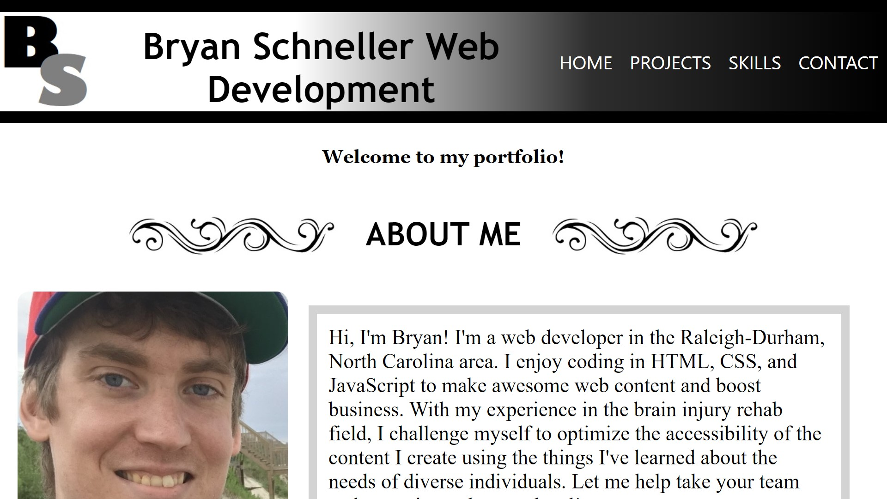

# Bryan Schneller's web development portfolio site

https://chairsitter.github.io/WebDevPortfolio/index.html

## Description

This site is a portfolio displaying my web development projects. It has an about me section with a paragraph and an image, a project section with descriptions and linked images of 
various sites and deployed games I made, and a section highlighting my web development skills. There is also a contact page with information about my email, LinkedIn, Indeed, and 
social media contacts. The site displays vertically in mobile orientation. 

## Installation

N/A

## Usage

This site can be used by a potential employer to get some information about me and my specific interests and skills within the web development field, including accessibility and
using complex Javascript logic to make games similar features. The site can be navigated through the linked navigation buttons on both pages, and individual projects can be accessed by clicking
the linked images to each deployed site. Potential employers can contact me using any method on the contacts page. 

## Credits

This is a proprietary website design.